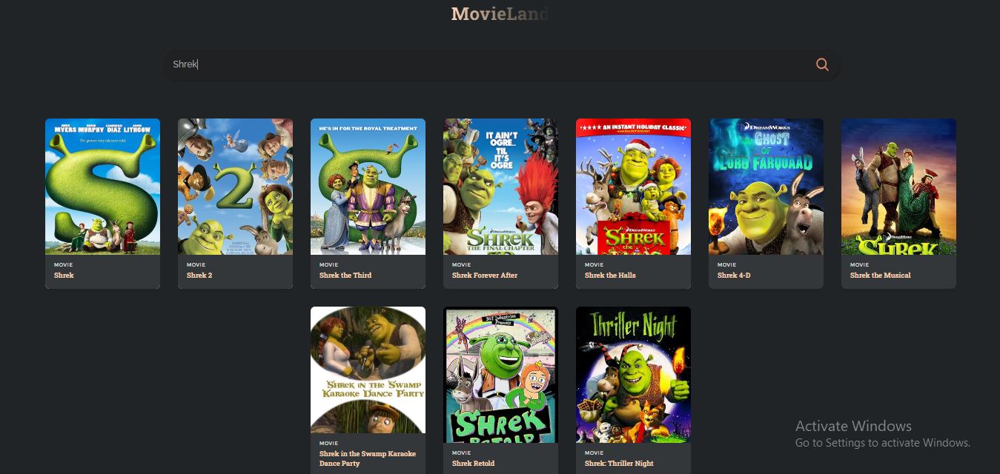

# MovieLand 🎬

MovieLand is a simple React app that allows users to search for movies using the OMDb API. This project is built to practice API integration, React hooks, and component-based design.

## Features 🚀
- Search for movies by title.
- Displays movie posters, titles, and years.
- Placeholder image shown if no poster is available.

## Technologies Used 🛠️
- React
- OMDb API
- JavaScript
- CSS

## Installation 🔧

1. Clone the repository:
   ```bash
   git clone https://github.com/yourusername/MovieLand.git

2. Navigate to the project folder:
   cd MovieLand

3. Install dependencies:
   npm install

4. Run the app:
    npm start

    The app will open in your browser at http://localhost:3000.

## API Used 🌍
    The project integrates with the OMDb API to fetch movie data.

## Screenshots



## Contributing 🤝
Feel free to fork this repository and submit issues or pull requests.

### Links

- OMDb API: [OMDb API](https://omdbapi.com/apikey.aspx)
- Live Site URL: [Live Site](https://ozo-movie-land.vercel.app/)